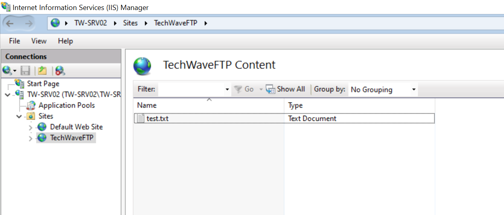

# Windows Server FTP Firewall Troubleshooting

## Overview

This project demonstrates a hands-on Windows Server troubleshooting scenario involving **IIS FTP, Windows Defender Firewall, PowerShell, and TCP connectivity testing**.

The lab was designed around a real-world Windows Server administration requirement: diagnosing why an FTP server was reachable over the network but unable to accept connections on **TCP port 21**.

The objective was not simply to configure FTP, but to **identify the cause of the connectivity failure, collect evidence, apply a targeted fix, and validate the result**.

---

## Lab Objective

Troubleshoot and resolve an FTP connectivity issue between a Windows Server client and an IIS FTP server.

### Initial problem

The FTP server was:

* Running the Microsoft FTP Service
* Listening on TCP port 21
* Reachable by IP address
* Configured with an IIS FTP binding

However, the client could not establish a TCP connection to port 21.

### Expected result

```text
TcpTestSucceeded : True
```

and a successful FTP connection displaying:

```text
220 Microsoft FTP Service
```

---

## Lab Environment

| Component                  | Configuration             |
| -------------------------- | ------------------------- |
| Client / Domain Controller | TW-DC01                   |
| Client IP                  | 172.16.0.4                |
| FTP Server                 | TW-SRV02                  |
| FTP Server IP              | 172.16.0.8                |
| Operating System           | Windows Server 2022       |
| FTP Platform               | IIS FTP                   |
| Protocol                   | FTP                       |
| Port                       | TCP 21                    |
| Administration             | PowerShell                |
| Firewall                   | Windows Defender Firewall |

---

## Technologies & Skills Demonstrated

* Windows Server Administration
* IIS FTP Server
* Windows Defender Firewall
* PowerShell
* TCP/IP troubleshooting
* Network connectivity testing
* Firewall rule management
* Firewall logging
* Service troubleshooting
* Port and listener verification
* Evidence-based troubleshooting

---

# Troubleshooting Process

## 1. Verify Windows Server Features

The first step was to verify that the required Windows Server and FTP components were installed.

```powershell
Get-WindowsFeature Web-Ftp-Server
```

The FTP Server feature was installed as part of the IIS configuration.


---

## 2. Verify Network Configuration

The network configuration of the FTP server was checked to confirm its IP address and network interface.

```powershell
Get-NetIPConfiguration

Get-NetIPAddress
```

The FTP server was configured with:

```text
172.16.0.8
```


---

## 3. Test FTP Connectivity

From the client server, connectivity to TCP port 21 was tested.

```powershell
Test-NetConnection 172.16.0.8 -Port 21
```

### Initial result

```text
TcpTestSucceeded : False
```

The server was reachable at the network layer, but TCP port 21 was not accepting the connection.


---

## 4. Verify IIS FTP Binding

The IIS FTP binding was checked to confirm that the FTP service was configured to listen on port 21.

```powershell
Get-WebBinding -Protocol ftp
```

The FTP binding showed:

```text
172.16.0.8:21
```


---

## 5. Verify Windows Firewall Rules

The Windows Defender Firewall rules associated with FTP were reviewed.

```powershell
Get-NetFirewallRule -DisplayGroup "FTP Server"
```

The FTP firewall rules were enabled, including the inbound FTP traffic rule.


At this point, the FTP service, IIS binding, and firewall rules appeared correctly configured.

The next step was to determine **what was actually happening to the network traffic**.

---

# 6. Enable Firewall Logging

Windows Defender Firewall logging was enabled to capture blocked traffic.

```powershell
Set-NetFirewallProfile `
  -Profile Domain,Private,Public `
  -LogBlocked True
```

The firewall configuration was then verified.

```powershell
Get-NetFirewallProfile
```


---

# 7. Identify the Root Cause

After generating another connection attempt from TW-DC01, the Windows Firewall log was inspected.

The log showed traffic from:

```text
172.16.0.4
```

to:

```text
172.16.0.8
```

on:

```text
TCP 21
```

being dropped.

This was the key piece of evidence.

### Root cause

**Windows Defender Firewall was dropping inbound TCP traffic to port 21 despite the existing FTP rule configuration.**

This changed the troubleshooting direction from investigating the FTP service to investigating firewall enforcement.

---

# 8. Apply a Targeted Firewall Rule

Rather than making broad firewall changes, an explicit inbound rule was created for TCP port 21 on the Private profile.

```powershell
New-NetFirewallRule `
  -DisplayName "TechWave FTP TCP 21 Inbound" `
  -Direction Inbound `
  -Protocol TCP `
  -LocalPort 21 `
  -Action Allow `
  -Profile Private
```

The rule specifically allowed inbound FTP traffic on TCP port 21.



---

# 9. Validate the Fix

The connection was tested again from **TW-DC01**.

```powershell
Test-NetConnection 172.16.0.8 -Port 21
```

### Result

```text
TcpTestSucceeded : True
```


The TCP connectivity problem was resolved.

---

# 10. Confirm FTP Application-Level Connectivity

A final FTP connection was established from the client.

```powershell
ftp 172.16.0.8
```

The server returned:

```text
220 Microsoft FTP Service
```

This confirmed that the issue was resolved beyond the TCP layer and that the FTP service was successfully reachable.


---

# Before vs. After

| Test                | Before Fix | After Fix                   |
| ------------------- | ---------- | --------------------------- |
| Server reachable    | ✓          | ✓                           |
| FTP Service running | ✓          | ✓                           |
| TCP 21 listening    | ✓          | ✓                           |
| IIS FTP binding     | ✓          | ✓                           |
| TCP 21 connectivity | ✗          | ✓                           |
| FTP connection      | ✗          | ✓                           |
| FTP server response | —          | `220 Microsoft FTP Service` |

---

# Troubleshooting Methodology

This lab reinforced a structured approach to Windows Server troubleshooting:

```text
Connectivity Test
       ↓
Service Verification
       ↓
Port / Listener Verification
       ↓
IIS Binding Verification
       ↓
Firewall Rule Review
       ↓
Firewall Logging
       ↓
Identify Dropped Traffic
       ↓
Apply Targeted Fix
       ↓
Retest
       ↓
Application-Level Validation
```

The important lesson was to **use evidence instead of assumptions**.

Rather than immediately disabling the firewall or making broad configuration changes, firewall logging was used to identify the actual traffic being dropped.

---

# Key PowerShell Commands

### Check FTP Windows Feature

```powershell
Get-WindowsFeature Web-Ftp-Server
```

### Check Network Configuration

```powershell
Get-NetIPConfiguration
Get-NetIPAddress
```

### Test TCP Port 21

```powershell
Test-NetConnection 172.16.0.8 -Port 21
```

### Check IIS FTP Binding

```powershell
Get-WebBinding -Protocol ftp
```

### Review FTP Firewall Rules

```powershell
Get-NetFirewallRule -DisplayGroup "FTP Server"
```

### Enable Firewall Logging

```powershell
Set-NetFirewallProfile `
  -Profile Domain,Private,Public `
  -LogBlocked True
```

### Create Targeted FTP Firewall Rule

```powershell
New-NetFirewallRule `
  -DisplayName "TechWave FTP TCP 21 Inbound" `
  -Direction Inbound `
  -Protocol TCP `
  -LocalPort 21 `
  -Action Allow `
  -Profile Private
```

### Test FTP Connection

```powershell
ftp 172.16.0.8
```

---

# Evidence

The screenshots included in this repository document the troubleshooting process from configuration and testing through diagnosis and successful resolution.

* Windows Server FTP feature installation
* Network configuration
* Initial TCP connectivity failure
* IIS FTP binding
* FTP firewall rules
* Firewall profile and logging configuration
* Firewall troubleshooting evidence
* Targeted FTP firewall rule
* Successful TCP connectivity
* Successful FTP connection

---

# Outcome

The FTP connectivity issue was successfully diagnosed and resolved.

### Final validation

```text
TcpTestSucceeded : True
```

and:

```text
220 Microsoft FTP Service
```

The lab demonstrates practical experience with **Windows Server networking, IIS FTP, Windows Defender Firewall, PowerShell, and systematic troubleshooting**.

---

# Career Relevance

This project demonstrates practical skills relevant to roles such as:

* Windows Administrator
* Windows Server Administrator
* Azure Administrator
* Azure Cloud Support Engineer
* Infrastructure Support Engineer
* IT Infrastructure Engineer
* Junior Systems Administrator

The focus of this project is not simply configuring a Windows Server. It demonstrates the ability to **investigate a production-style connectivity problem, identify the failing layer, use logs as evidence, implement a targeted remediation, and verify the result.**

---

## Author

**Agatha Nweze**

Windows Server | Azure | PowerShell | Infrastructure Support

GitHub: [Acnweze](https://github.com/Acnweze)

