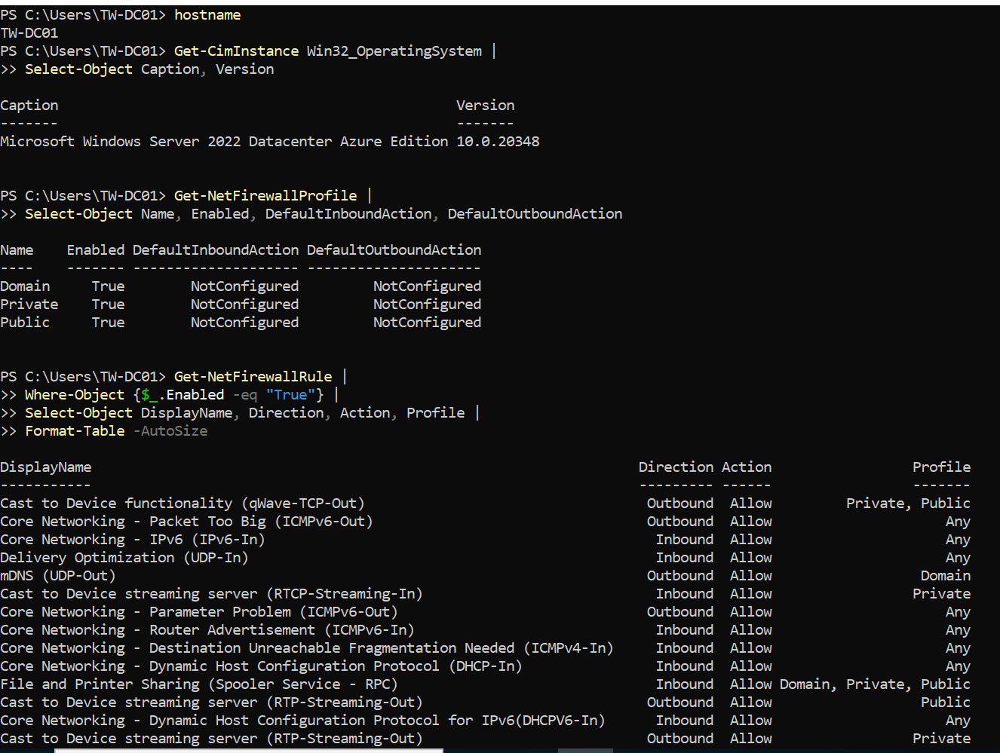
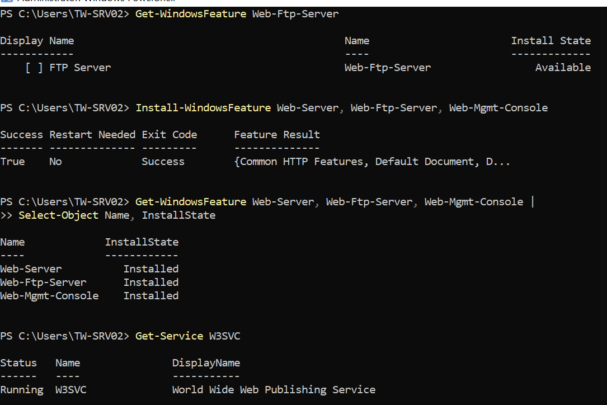
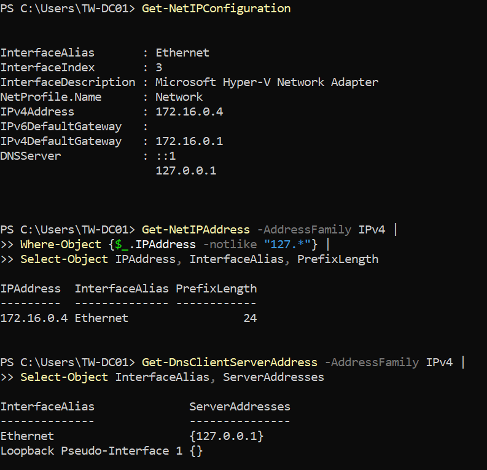
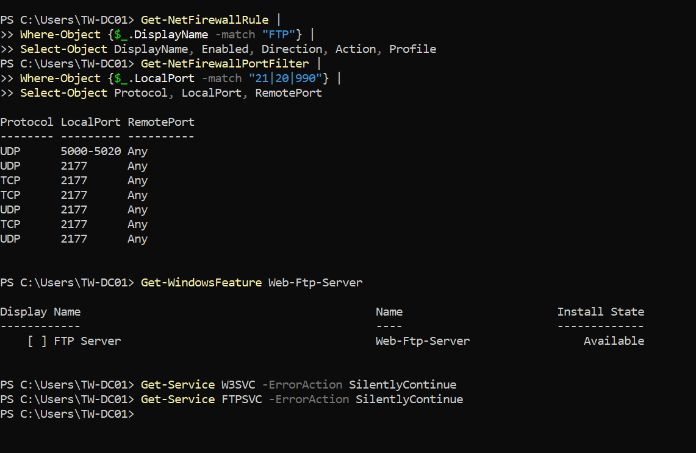
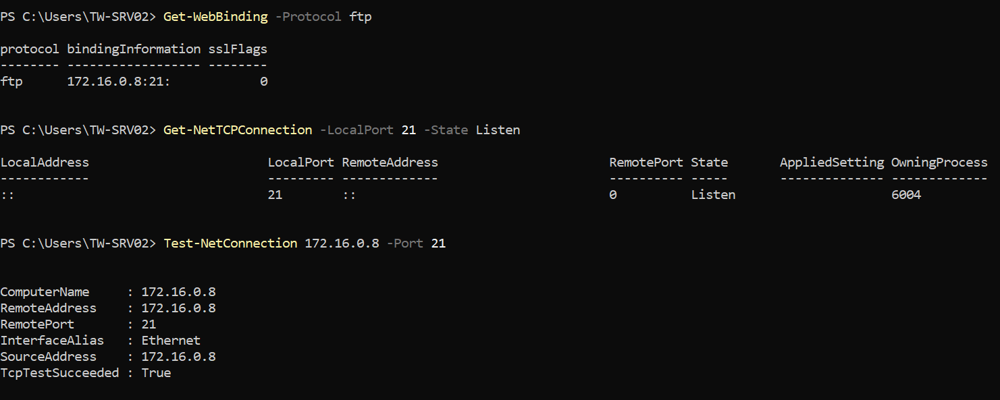
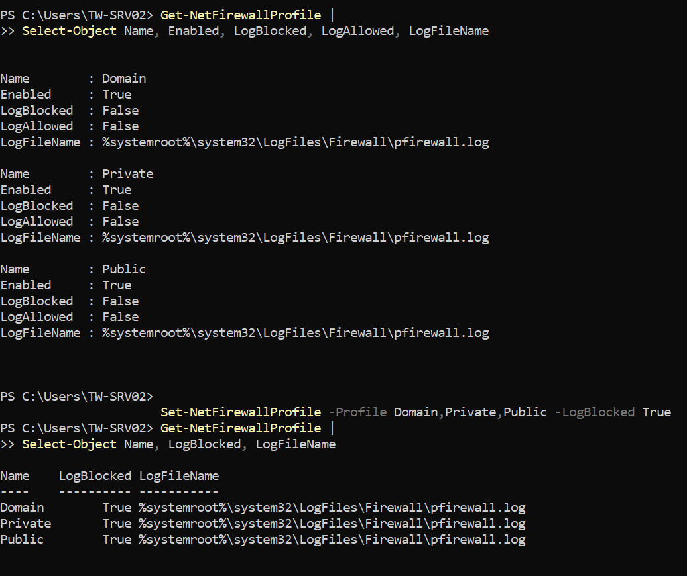
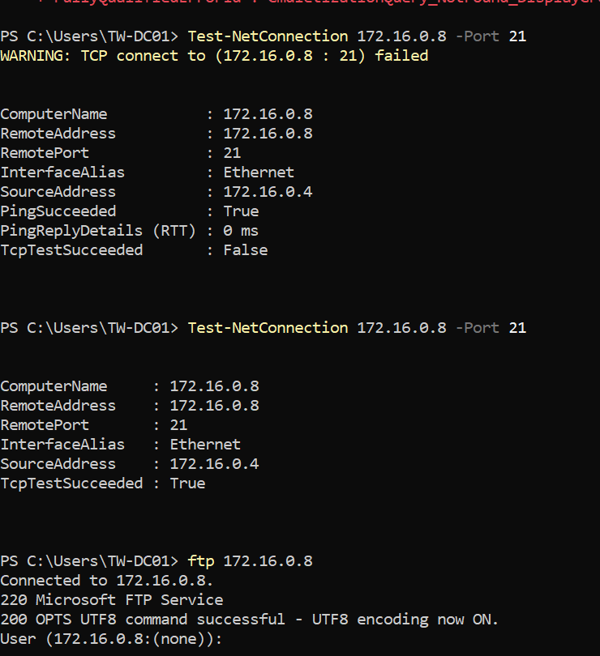

# Windows Server FTP Firewall Troubleshooting

## Overview

This project demonstrates a hands-on troubleshooting scenario involving **Windows Server, IIS FTP, TCP connectivity, and Windows Firewall**.

The FTP server was reachable over the network, but clients could not establish a connection to **TCP port 21**.

Instead of disabling the firewall, I used PowerShell, IIS configuration checks, network testing, and Windows Firewall logging to identify and resolve the issue.

---

## Objective

* Configure an IIS FTP server
* Verify network connectivity
* Test TCP port 21
* Verify the IIS FTP binding
* Review Windows Firewall configuration
* Enable firewall logging
* Identify blocked FTP traffic
* Create a targeted firewall rule
* Validate the fix from a remote client

---

## Lab Environment

| Component        | Details             |
| ---------------- | ------------------- |
| FTP Server       | TW-SRV02            |
| FTP Server IP    | 172.16.0.8          |
| Client           | TW-DC01             |
| Client IP        | 172.16.0.4          |
| Operating System | Windows Server 2022 |
| FTP Platform     | IIS FTP             |
| Protocol         | FTP                 |
| TCP Port         | 21                  |
| Management       | PowerShell          |

---

## Technologies & Skills

* Windows Server 2022
* IIS FTP Server
* Windows Firewall
* PowerShell
* TCP/IP Networking
* Network Troubleshooting
* Firewall Logging
* Connectivity Testing
* Infrastructure Troubleshooting

---

# Troubleshooting Process

## 1. Verify Windows Firewall Profile

I first checked the active Windows Firewall profiles to understand the current firewall configuration.

```powershell
Get-CimInstance -ClassName Win32_OperatingSystem
Get-NetFirewallProfile
```



---

## 2. Verify the FTP Server Feature

I confirmed that the IIS FTP Server feature was installed and available.

```powershell
Get-WindowsFeature Web-Ftp-Server
```

The FTP Server feature was installed on TW-SRV02.



---

## 3. Verify Network Configuration

I checked the server's IP configuration and confirmed that TW-SRV02 was using the expected IP address.

```powershell
Get-NetIPConfiguration
Get-NetIPAddress
```

The FTP server was configured with:

```text
172.16.0.8
```



---

## 4. Review FTP Firewall Rules

I reviewed the existing Windows Firewall rules related to FTP and confirmed the installed FTP components.

```powershell
Get-NetFirewallRule
Get-WindowsFeature Web-Ftp-Server
```



---

## 5. Verify the IIS FTP Binding

I checked the IIS FTP binding to confirm that the FTP service was configured to listen on TCP port 21.

```powershell
Get-WebBinding -Protocol ftp
```

The FTP binding was configured for:

```text
172.16.0.8:21
```



---

## 6. Enable Windows Firewall Logging

Because the FTP service and binding appeared to be configured correctly, I enabled Windows Firewall logging to determine whether traffic was being blocked.

```powershell
Set-NetFirewallProfile `
    -Profile Domain,Private,Public `
    -LogBlocked True

Get-NetFirewallProfile |
    Select-Object Name, LogBlocked, LogFileName
```



---

## 7. Identify the Blocked Connection

From TW-DC01, I tested connectivity to TCP port 21 on the FTP server.

```powershell
Test-NetConnection 172.16.0.8 -Port 21
```

The connection initially failed:

```text
TcpTestSucceeded : False
```

The Windows Firewall log showed that traffic from the client was being dropped when attempting to reach TCP port 21.

This confirmed that the problem was a **Windows Firewall filtering issue**, rather than an FTP service or network configuration problem.



---

## 8. Create a Targeted Firewall Rule

Instead of disabling the firewall, I created a specific inbound rule allowing TCP port 21 for the required network profile.

```powershell
New-NetFirewallRule `
    -DisplayName "TechWave FTP TCP 21 Inbound" `
    -Direction Inbound `
    -Protocol TCP `
    -LocalPort 21 `
    -Action Allow `
    -Profile Private
```

This approach keeps the firewall enabled while allowing only the required FTP control connection.

---

## 9. Retest TCP Connectivity

After creating the firewall rule, I tested TCP port 21 again from TW-DC01.

```powershell
Test-NetConnection 172.16.0.8 -Port 21
```

The result changed to:

```text
TcpTestSucceeded : True
```

---

## 10. Validate FTP Application Connectivity

Finally, I tested the FTP connection directly.

```powershell
ftp 172.16.0.8
```

The connection succeeded and returned:

```text
Connected to 172.16.0.8.
220 Microsoft FTP Service
```


---

# Before vs. After

| Test                   | Before    | After                       |
| ---------------------- | --------- | --------------------------- |
| Server reachable       | ✓         | ✓                           |
| FTP service configured | ✓         | ✓                           |
| IIS FTP binding        | ✓         | ✓                           |
| TCP port 21            | ✗ Blocked | ✓ Allowed                   |
| FTP connection         | ✗ Failed  | ✓ Successful                |
| FTP response           | —         | `220 Microsoft FTP Service` |

---

# Troubleshooting Methodology

The troubleshooting process followed an evidence-based approach:

```text
Verify Server
     ↓
Verify Network Configuration
     ↓
Verify FTP Installation
     ↓
Verify IIS FTP Binding
     ↓
Test TCP Port 21
     ↓
Enable Firewall Logging
     ↓
Identify Firewall Drop
     ↓
Create Targeted Firewall Rule
     ↓
Retest TCP Port 21
     ↓
Test FTP Application
```

This demonstrates the importance of **isolating the failure before making configuration changes**.

---

# Key PowerShell Commands

### Check FTP feature

```powershell
Get-WindowsFeature Web-Ftp-Server
```

### Check network configuration

```powershell
Get-NetIPConfiguration
Get-NetIPAddress
```

### Check FTP binding

```powershell
Get-WebBinding -Protocol ftp
```

### Test TCP connectivity

```powershell
Test-NetConnection 172.16.0.8 -Port 21
```

### Check firewall profiles

```powershell
Get-NetFirewallProfile
```

### Enable firewall logging

```powershell
Set-NetFirewallProfile `
    -Profile Domain,Private,Public `
    -LogBlocked True
```

### Create an FTP firewall rule

```powershell
New-NetFirewallRule `
    -DisplayName "TechWave FTP TCP 21 Inbound" `
    -Direction Inbound `
    -Protocol TCP `
    -LocalPort 21 `
    -Action Allow `
    -Profile Private
```

### Test FTP

```powershell
ftp 172.16.0.8
```

---

# Evidence

The lab evidence includes:

1. Windows Firewall profile configuration
2. IIS FTP Server feature installation
3. Server network configuration
4. Existing FTP firewall rules
5. IIS FTP binding
6. Windows Firewall logging configuration
7. Failed TCP port 21 test
8. Successful FTP connection

---

# Final Result

The FTP server was initially reachable but TCP port 21 was being blocked by Windows Firewall.

After reviewing firewall logs and creating a targeted inbound rule:

```text
TCP Port 21: BLOCKED ✗
        ↓
Firewall Rule Applied
        ↓
TCP Port 21: ALLOWED ✓
        ↓
FTP Connection: SUCCESSFUL ✓
```

The final FTP connection returned:

```text
220 Microsoft FTP Service
```

---

# Career Relevance

This lab demonstrates practical skills relevant to:

* Windows Server Administration
* Windows Infrastructure Support
* Azure Administrator roles
* Cloud Support Engineering
* Network Troubleshooting
* IIS Administration
* Firewall Administration
* PowerShell Administration

The key lesson from this experiment was to **troubleshoot from evidence rather than immediately disabling security controls**.
